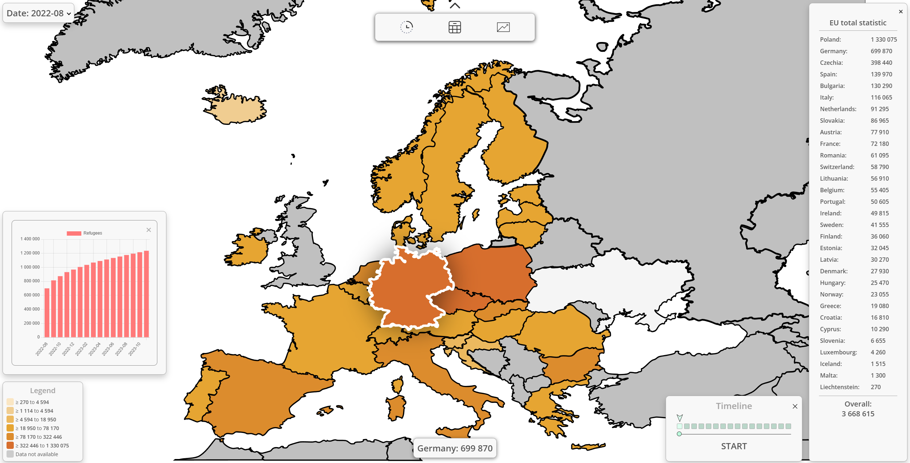
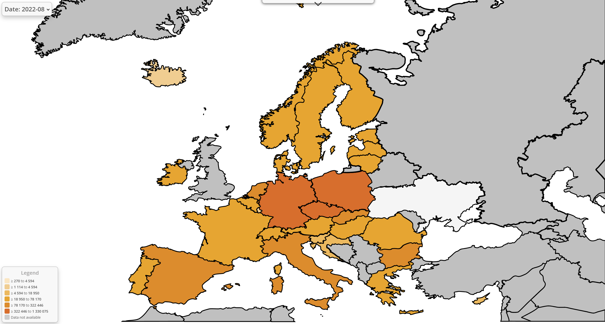

# Refugees from Ukraine in Europe — Interactive Map
This project visualizes the number of Ukrainian refugees distributed across European countries. It features an interactive SVG map with a timeline slider, detailed country statistics, and dynamic charts. Users can select specific dates and observe changes over time.

# 🔍 Features:
Interactive map of Europe.
Per-country refugee statistics (shown in the right sidebar).
Timeline slider to track changes by month.
Bar chart displaying overall refugee growth.
Color-coded map legend by refugee count.

# 🛠️ Technologies used:
HTML, CSS, JavaScript
SVG map rendering
Modular CSS for each UI component (menu, chart, legend, slider, etc.)
Chart.js for visualizations
Google Fonts (Open Sans)

# 📂 Project structure:
index.html — Main HTML layout for the interface.
css/ — Styles for the map, menus, chart, legend, etc.
images/ — Icons and UI buttons (e.g., timeline, table, chart).
js/ — JavaScripts for interactivity.

# 📸 Screenshots:

